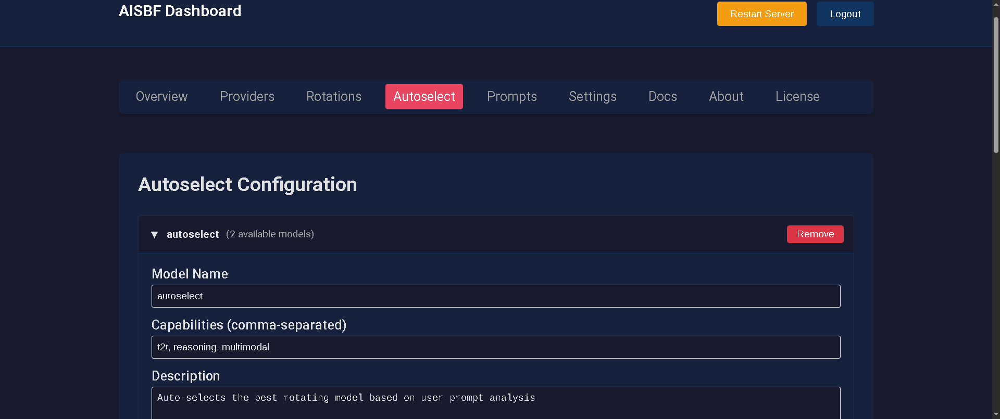

# AISBF - AI Service Broker Framework || AI Should Be Free

A modular proxy server for managing multiple AI provider integrations with unified API interface. AISBF provides intelligent routing, load balancing, and AI-assisted model selection to optimize AI service usage across multiple providers.



## Web Dashboard

AISBF includes a comprehensive web-based dashboard for easy configuration and management:

- **Provider Management**: Configure API keys, endpoints, and model settings with automatic metadata extraction
- **Rotation Configuration**: Set up weighted load balancing across providers
- **Autoselect Configuration**: Configure AI-powered model selection
- **Server Settings**: Manage SSL/TLS, authentication, and TOR hidden service
- **User Management**: Create/manage users with role-based access control (admin users only)
- **Multi-User Support**: Isolated configurations per user with API token management
- **Real-time Monitoring**: View provider status and configuration
- **Token Usage Analytics**: Track token usage, costs, and performance with charts, filtering by provider/model/rotation, and export functionality
- **Rate Limits Dashboard**: Monitor adaptive rate limiting with real-time statistics, 429 counts, success rates, and recovery progress
- **Model Metadata Display**: View detailed model information including pricing, rate limits, and supported parameters
- **Cache Management**: View cache statistics and clear cache via dashboard endpoints

Access the dashboard at `http://localhost:17765/dashboard` (default credentials: admin/admin)

## Key Features

- **Multi-Provider Support**: Unified interface for Google, OpenAI, Anthropic, Ollama, Kiro (Amazon Q Developer), Kiro-cli, Claude Code (OAuth2), Kilocode (OAuth2), and Codex (OAuth2)
- **Claude OAuth2 Authentication**: Full OAuth2 PKCE flow for Claude Code with automatic token refresh and Chrome extension for remote servers
- **Kilocode OAuth2 Authentication**: OAuth2 Device Authorization Grant for Kilo Code with automatic token refresh
- **Codex OAuth2 Authentication**: OAuth2 Device Authorization Grant for OpenAI Codex with automatic token refresh and API key exchange
- **Rotation Models**: Weighted load balancing across multiple providers with automatic failover
- **Autoselect Models**: AI-powered model selection based on content analysis and request characteristics
- **Semantic Classification**: Fast hybrid BM25 + semantic model selection using sentence transformers (optional)
- **Content Classification**: NSFW/privacy content filtering with configurable classification windows
- **Streaming Support**: Full support for streaming responses from all providers
- **Error Tracking**: Automatic provider disabling after consecutive failures with configurable cooldown periods
- **Adaptive Rate Limiting**: Intelligent rate limit management that learns from 429 responses with exponential backoff, gradual recovery, and dashboard monitoring
- **Rate Limiting**: Built-in rate limiting and graceful error handling
- **Request Splitting**: Automatic splitting of large requests when exceeding `max_request_tokens` limit
- **Token Rate Limiting**: Per-model token usage tracking with TPM (tokens per minute), TPH (tokens per hour), and TPD (tokens per day) limits
- **Automatic Provider Disabling**: Providers automatically disabled when token rate limits are exceeded
- **Context Management**: Automatic context condensation when approaching model limits with multiple condensation methods
- **Provider-Level Defaults**: Set default condensation settings at provider level with cascading fallback logic
- **Effective Context Tracking**: Reports total tokens used (effective_context) for every request
- **Enhanced Context Condensation**: 8 condensation methods including hierarchical, conversational, semantic, algorithmic, sliding window, importance-based, entity-aware, and code-aware condensation
- **Provider-Native Caching**: 50-70% cost reduction using Anthropic `cache_control`, Google Context Caching, and OpenAI-compatible APIs (including prompt_cache_key for OpenAI load balancer routing)
- **Response Caching (Semantic Deduplication)**: 20-30% cache hit rate with intelligent request deduplication
  - Multiple backends: In-memory LRU cache, Redis, SQLite, MySQL, file-based
  - SHA256-based cache key generation for request deduplication
  - TTL-based expiration with configurable timeouts
  - Granular cache control at model, provider, rotation, and autoselect levels
  - Cache statistics tracking (hits, misses, hit rate, evictions)
  - Dashboard endpoints for cache management
- **Smart Request Batching**: 15-25% latency reduction by batching similar requests within 100ms window with provider-specific configurations
- **Streaming Response Optimization**: 10-20% memory reduction with chunk pooling, backpressure handling, and provider-specific streaming optimizations for Google and Kiro providers
- **Token Usage Analytics**: Comprehensive analytics dashboard with charts, cost estimation, performance tracking, filtering by provider/model/rotation, and export functionality
- **Model Metadata Extraction**: Automatic extraction of pricing, rate limits, and model information from provider responses with dashboard display
- **SSL/TLS Support**: Built-in HTTPS support with Let's Encrypt integration and automatic certificate renewal
- **Self-Signed Certificates**: Automatic generation of self-signed certificates for development/testing
- **TOR Hidden Service**: Full support for exposing AISBF over TOR network as a hidden service (ephemeral and persistent)
- **MCP Server**: Model Context Protocol server for remote agent configuration and model access (SSE and HTTP streaming)
- **Persistent Database**: SQLite/MySQL-based tracking of token usage, context dimensions, and model embeddings with automatic cleanup
- **Multi-User Support**: User management with isolated configurations, role-based access control, and API token management
- **User-Specific API Endpoints**: Dedicated API endpoints for authenticated users to access their own configurations with Bearer token authentication
- **Database Integration**: SQLite/MySQL-based persistent storage for user configurations, token usage tracking, and context management
- **User-Specific Configurations**: Each user can have their own providers, rotations, and autoselect configurations stored in the database
- **Flexible Caching System**: Multi-backend caching for model embeddings and performance optimization
  - Redis: High-performance distributed caching for production
  - SQLite/MySQL: Persistent database-backed caching
  - File-based: Legacy local file storage
  - Memory: In-memory caching for development
  - Automatic fallback between backends
  - Configurable TTL per data type
- **Proxy-Awareness**: Full support for reverse proxy deployments with automatic URL generation and subpath support

## Author

Stefy Lanza <stefy@nexlab.net>

## Repository

Official repository: https://git.nexlab.net/nexlab/aisbf.git

## Quick Start

### Installation

#### From PyPI (Recommended)
```bash
pip install aisbf
```

#### From Source
```bash
python setup.py install
```

### Usage
```bash
aisbf
```

Server starts on `http://127.0.0.1:17765`

## Development

### Building the Package

To build the package for PyPI distribution:

```bash
./build.sh
```

This creates distribution files in the `dist/` directory.

### Cleaning Build Artifacts

To remove all build artifacts and temporary files:

```bash
./clean.sh
```

### PyPI Publishing

See [`PYPI.md`](PYPI.md) for detailed instructions on publishing to PyPI.

## Supported Providers
- Google (google-genai)
- OpenAI and openai-compatible endpoints (openai)
- Anthropic (anthropic)
- Claude Code (OAuth2 authentication via claude.ai)
- Ollama (direct HTTP)
- Kiro (Amazon Q Developer / AWS CodeWhisperer)
- Kiro-cli (Amazon Q Developer CLI authentication)
- Kilocode (OAuth2 Device Authorization Grant)
- Codex (OAuth2 Device Authorization Grant - OpenAI protocol)

### Kiro-cli Provider Support

AISBF supports Kiro (Amazon Q Developer) via kiro-cli authentication using Device Authorization Grant flow:

#### Features
- Full OAuth2 Device Authorization Grant flow matching official kiro-cli
- Automatic token refresh
- SQLite database-based credential storage
- Dashboard integration with authentication UI
- Credentials stored in user-configured SQLite database path

#### Setup
1. Add kiro-cli provider to configuration (via dashboard or `~/.aisbf/providers.json`)
2. Configure sqlite_db path pointing to kiro-cli credentials database
3. Use kiro-cli models via API: `kiro-cli/anthropic.claude-3-5-sonnet-20241022-v2:0`

#### Configuration Example
```json
{
  "providers": {
    "kiro-cli": {
      "id": "kiro-cli",
      "name": "Kiro-cli (Amazon Q Developer)",
      "endpoint": "https://q.us-east-1.amazonaws.com",
      "type": "kiro",
      "api_key_required": false,
      "kiro_config": {
        "region": "us-east-1",
        "sqlite_db": "~/.config/kiro/kiro.db"
      },
      "models": [
        {
          "name": "anthropic.claude-3-5-sonnet-20241022-v2:0",
          "context_size": 200000
        }
      ]
    }
  }
}
```

### Kilocode OAuth2 Authentication

AISBF supports Kilo Code as a provider using OAuth2 Device Authorization Grant:

#### Features
- Full OAuth2 Device Authorization Grant flow
- Automatic token refresh with refresh token rotation
- Dashboard integration with authentication UI
- Proxy-aware callback handling
- Credentials stored in `~/.aisbf/kilo_credentials.json`

#### Setup
1. Add kilocode provider to configuration (via dashboard or `~/.aisbf/providers.json`)
2. Click "Authenticate with Kilo" in dashboard
3. Complete device authorization flow
4. Use kilocode models via API: `kilocode/<model>`

#### Configuration Example
```json
{
  "providers": {
    "kilocode": {
      "id": "kilocode",
      "name": "Kilo Code (OAuth2)",
      "endpoint": "https://api.kilo.dev/v1",
      "type": "kilo",
      "api_key_required": false,
      "kilo_config": {
        "credentials_file": "~/.aisbf/kilo_credentials.json"
      },
      "models": [
        {
          "name": "kilo/free",
          "context_size": 100000
        }
      ]
    }
  }
}
```

See [`KILO_OAUTH2.md`](KILO_OAUTH2.md) for detailed setup instructions.

### Codex OAuth2 Authentication

AISBF supports OpenAI Codex as a provider using OAuth2 Device Authorization Grant:

#### Features
- Full OAuth2 Device Authorization Grant flow (same protocol as OpenAI)
- Automatic token refresh with refresh token rotation
- API key exchange from ID token for direct API access
- Dashboard integration with authentication UI
- No localhost callback port needed (device code flow)
- Credentials stored in `~/.aisbf/codex_credentials.json`

#### Setup
1. Add codex provider to configuration (via dashboard or `~/.aisbf/providers.json`)
2. Click "Authenticate with Codex (Device Code)" in dashboard
3. Complete device authorization flow at `https://auth.openai.com/codex/device`
4. Use codex models via API: `codex/<model>`

#### Configuration Example
```json
{
  "providers": {
    "codex": {
      "id": "codex",
      "name": "Codex (OpenAI OAuth2)",
      "endpoint": "https://api.openai.com/v1",
      "type": "codex",
      "api_key_required": false,
      "codex_config": {
        "credentials_file": "~/.aisbf/codex_credentials.json",
        "issuer": "https://auth.openai.com"
      },
      "models": [
        {
          "name": "gpt-4o",
          "context_size": 128000
        }
      ]
    }
  }
}
```

## Configuration

### SSL/TLS Configuration

AISBF supports HTTPS with automatic certificate management:

#### Self-Signed Certificates (Default)
- Automatically generated on first run when HTTPS is enabled
- Stored in `~/.aisbf/cert.pem` and `~/.aisbf/key.pem`
- Valid for 365 days
- Suitable for development and internal use

#### Let's Encrypt Integration
Configure a public domain in the dashboard settings to enable Let's Encrypt:
- Automatic certificate generation using certbot
- Automatic renewal when certificates expire within 30 days
- Valid certificates trusted by all browsers
- Requires certbot to be installed on the system

**Installation:**
```bash
# Ubuntu/Debian
sudo apt-get install certbot

# CentOS/RHEL
sudo yum install certbot

# macOS
brew install certbot
```

**Configuration:**
1. Navigate to Dashboard → Settings
2. Set Protocol to "HTTPS"
3. Enter your public domain (e.g., `api.example.com`)
4. Optionally specify custom certificate/key paths
5. Save settings

The system will automatically:
- Generate certificates using Let's Encrypt if a public domain is configured
- Fall back to self-signed certificates if Let's Encrypt fails
- Check certificate expiry on startup
- Renew certificates when they expire within 30 days

### TOR Hidden Service Configuration

AISBF can be exposed over the TOR network as a hidden service, providing anonymous access to your AI proxy server.

#### Prerequisites
- TOR must be installed and running on your system
- TOR control port must be enabled (default: 9051)

**Installation:**
```bash
# Ubuntu/Debian
sudo apt-get install tor

# CentOS/RHEL
sudo yum install tor

# macOS
brew install tor
```

**Enable TOR Control Port:**
Edit `/etc/tor/torrc` (or `~/.torrc` on macOS) and add:
```
ControlPort 9051
CookieAuthentication 1
```

Then restart TOR:
```bash
sudo systemctl restart tor  # Linux
brew services restart tor   # macOS
```

#### Configuration

**Via Dashboard:**
1. Navigate to Dashboard → Settings
2. Scroll to "TOR Hidden Service" section
3. Enable "Enable TOR Hidden Service"
4. Configure settings:
   - **Control Host**: TOR control port host (default: 127.0.0.1)
   - **Control Port**: TOR control port (default: 9051)
   - **Control Password**: Optional password for TOR control authentication
   - **Hidden Service Directory**: Leave blank for ephemeral service, or specify path for persistent service
   - **Hidden Service Port**: Port exposed on the hidden service (default: 80)
   - **SOCKS Proxy Host**: TOR SOCKS proxy host (default: 127.0.0.1)
   - **SOCKS Proxy Port**: TOR SOCKS proxy port (default: 9050)
5. Save settings and restart server

**Via Configuration File:**
Edit `~/.aisbf/aisbf.json`:
```json
{
  "tor": {
    "enabled": true,
    "control_port": 9051,
    "control_host": "127.0.0.1",
    "control_password": null,
    "hidden_service_dir": null,
    "hidden_service_port": 80,
    "socks_port": 9050,
    "socks_host": "127.0.0.1"
  }
}
```

#### Ephemeral vs Persistent Hidden Services

**Ephemeral (Default):**
- Temporary hidden service created on startup
- New onion address generated each time
- No files stored on disk
- Ideal for temporary or testing purposes
- Set `hidden_service_dir` to `null` or leave blank

**Persistent:**
- Permanent hidden service with fixed onion address
- Address persists across restarts
- Keys stored in specified directory
- Ideal for production use
- Set `hidden_service_dir` to a path (e.g., `~/.aisbf/tor_hidden_service`)

#### Accessing Your Hidden Service

Once enabled, the onion address will be displayed:
- In the server logs on startup
- In the Dashboard → Settings → TOR Hidden Service status section
- Via MCP `get_tor_status` tool (requires fullconfig access)

Access your service via TOR Browser or any TOR-enabled client:
```
http://your-onion-address.onion/
```

#### Security Considerations

- TOR hidden services provide anonymity but not authentication
- Enable API authentication in AISBF settings for additional security
- Use strong dashboard passwords
- Consider using persistent hidden services for production
- Monitor access logs for suspicious activity
- Keep TOR and AISBF updated

### Claude OAuth2 Authentication

AISBF supports Claude Code (claude.ai) as a provider using OAuth2 authentication with automatic token refresh:

#### Features
- Full OAuth2 PKCE flow matching official claude-cli
- Automatic token refresh with refresh token rotation
- Chrome extension for remote server OAuth2 callback interception
- Dashboard integration with authentication UI
- Proxy-aware extension serving: automatically detects reverse proxy deployments
- Force interception mechanism: extension activates for localhost when OAuth flow initiated from dashboard
- Supports nginx, caddy, and other reverse proxies with X-Forwarded-* header detection
- Credentials stored in `~/.aisbf/claude_credentials.json`
- Optional curl_cffi TLS fingerprinting for Cloudflare bypass
- Compatible with official claude-cli credentials

#### Setup
1. Add Claude provider to configuration (via dashboard or `~/.aisbf/providers.json`)
2. For remote servers: Install Chrome extension (download from dashboard)
3. Click "Authenticate with Claude" in dashboard
4. Log in with your Claude account
5. Use Claude models via API: `claude/claude-3-7-sonnet-20250219`

#### Configuration Example
```json
{
  "providers": {
    "claude": {
      "id": "claude",
      "name": "Claude Code (OAuth2)",
      "endpoint": "https://api.anthropic.com/v1",
      "type": "claude",
      "api_key_required": false,
      "claude_config": {
        "credentials_file": "~/.aisbf/claude_credentials.json"
      },
      "models": [
        {
          "name": "claude-3-7-sonnet-20250219",
          "context_size": 200000
        }
      ]
    }
  }
}
```

See [`CLAUDE_OAUTH2_SETUP.md`](CLAUDE_OAUTH2_SETUP.md) for detailed setup instructions and [`CLAUDE_OAUTH2_DEEP_DIVE.md`](CLAUDE_OAUTH2_DEEP_DIVE.md) for technical details.

### Response Caching (Semantic Deduplication)

AISBF includes an intelligent response caching system that deduplicates similar requests to reduce API costs and latency:

#### Supported Cache Backends
- **Memory (LRU)**: In-memory cache with LRU eviction, fast but ephemeral
- **Redis**: High-performance distributed caching, recommended for production
- **SQLite**: Persistent local database caching
- **MySQL**: Network database caching for multi-server deployments

#### Features
- **SHA256-based Deduplication**: Generates cache keys from request content for intelligent deduplication
- **TTL-based Expiration**: Configurable timeout (default: 600 seconds)
- **LRU Eviction**: Automatic eviction of least recently used entries (memory backend)
- **Cache Statistics**: Tracks hits, misses, hit rate, and evictions
- **Granular Control**: Enable/disable caching at model, provider, rotation, or autoselect level
- **Hierarchical Configuration**: Model > Provider > Rotation > Autoselect > Global
- **Dashboard Management**: View statistics and clear cache via dashboard
- **Streaming Skip**: Automatically skips caching for streaming requests

#### Configuration

**Via Dashboard:**
1. Navigate to Dashboard → Settings → Response Cache
2. Enable response caching
3. Select cache backend (Memory, Redis, SQLite, MySQL)
4. Configure TTL and max size
5. Save settings and restart server

**Via Configuration File:**
Edit `~/.aisbf/aisbf.json`:
```json
{
  "response_cache": {
    "enabled": true,
    "backend": "redis",
    "ttl": 600,
    "max_size": 1000,
    "redis_host": "localhost",
    "redis_port": 6379
  }
}
```

**Cache Hit Rate:** Typically achieves 20-30% cache hit rate in production workloads, significantly reducing API costs and latency.

### Database Configuration

AISBF supports multiple database backends for persistent storage of configurations, token usage tracking, and context management:

#### Supported Databases
- **SQLite** (Default): File-based database, no additional setup required, suitable for most users
- **MySQL**: Network database server, better for multi-server deployments and advanced analytics

#### SQLite Configuration (Default)
SQLite is automatically configured and requires no additional setup:
- Database file: `~/.aisbf/aisbf.db`
- Automatic initialization and table creation
- WAL mode enabled for concurrent access
- Automatic cleanup of old records

#### MySQL Configuration
For production deployments requiring MySQL:

**Prerequisites:**
- MySQL server installed and running
- Database and user created with appropriate permissions

**Via Dashboard:**
1. Navigate to Dashboard → Settings → Database Configuration
2. Select "MySQL" as database type
3. Configure connection parameters:
   - **Host**: MySQL server hostname/IP
   - **Port**: MySQL server port (default: 3306)
   - **Username**: MySQL database username
   - **Password**: MySQL database password
   - **Database**: MySQL database name
4. Save settings and restart server

**Via Configuration File:**
Edit `~/.aisbf/aisbf.json`:
```json
{
  "database": {
    "type": "mysql",
    "mysql_host": "localhost",
    "mysql_port": 3306,
    "mysql_user": "aisbf",
    "mysql_password": "your_password",
    "mysql_database": "aisbf"
  }
}
```

**Database Migration:**
When switching database types, AISBF will automatically create tables in the new database. Existing data will not be migrated automatically - you may need to export/import configurations manually.

### Cache Configuration

AISBF includes a flexible caching system for improved performance and reduced API costs:

#### Supported Cache Backends
- **SQLite** (Default): Local database storage, persistent and structured
- **MySQL**: Network database caching, scalable for multi-server deployments
- **Redis**: High-performance distributed caching, recommended for production
- **File-based**: Legacy local file storage
- **Memory**: In-memory caching (ephemeral, lost on restart)

#### Cache Features
- **Model Embeddings**: Cached vectorized model descriptions for semantic matching
- **Provider Models**: Cached API model listings with configurable TTL
- **Automatic Fallback**: Falls back to file-based if Redis is unavailable
- **Configurable TTL**: Set cache expiration times per data type

#### Redis Configuration
For high-performance caching in production environments:

**Prerequisites:**
- Redis server installed and running
- Optional: Redis authentication configured

**Via Dashboard:**
1. Navigate to Dashboard → Settings → Cache Configuration
2. Select "Redis" as cache type
3. Configure connection parameters:
   - **Host**: Redis server hostname/IP
   - **Port**: Redis server port (default: 6379)
   - **Database**: Redis database number (default: 0)
   - **Password**: Redis password (optional)
   - **Key Prefix**: Prefix for Redis keys (default: aisbf:)
4. Save settings and restart server

**Via Configuration File:**
Edit `~/.aisbf/aisbf.json`:
```json
{
  "cache": {
    "type": "redis",
    "redis_host": "localhost",
    "redis_port": 6379,
    "redis_db": 0,
    "redis_password": "",
    "redis_key_prefix": "aisbf:"
  }
}
```

#### Cache Performance Benefits
- **Faster Model Selection**: Cached embeddings eliminate repeated vectorization
- **Reduced API Calls**: Cached provider model listings reduce API overhead
- **Lower Latency**: Redis provides sub-millisecond cache access
- **Scalability**: Distributed Redis supports multiple AISBF instances

### Provider-Native Caching Configuration

AISBF supports provider-native caching for reduced API costs and latency across multiple provider types:

#### Supported Providers

| Provider | Caching Method | Configuration |
|----------|---------------|---------------|
| **OpenAI** | Automatic prefix caching (no code change needed) | Enabled by default for prompts >1024 tokens |
| **DeepSeek** | Automatic in 64-token chunks | Enabled by default |
| **Anthropic** | `cache_control` with `{"type": "ephemeral"}` | Requires `enable_native_caching: true` |
| **OpenRouter** | `cache_control` (wraps Anthropic) | Requires `enable_native_caching: true` |
| **Google** | Context Caching API (`cached_contents.create`) | Requires `enable_native_caching: true` and `cache_ttl` |

#### Configuration Options

Add to provider configuration in `providers.json`:

```json
{
  "providers": {
    "my_provider": {
      "type": "openai",
      "endpoint": "https://api.openrouter.ai/v1",
      "enable_native_caching": true,
      "min_cacheable_tokens": 1024,
      "prompt_cache_key": "optional-cache-key-for-load-balancer"
    },
    "anthropic_provider": {
      "type": "anthropic",
      "api_key_required": true,
      "enable_native_caching": true,
      "min_cacheable_tokens": 1024
    },
    "google_provider": {
      "type": "google",
      "api_key_required": true,
      "enable_native_caching": true,
      "cache_ttl": 3600,
      "min_cacheable_tokens": 1024
    }
  }
}
```

#### Configuration Fields

- **`enable_native_caching`**: Enable provider-native caching (boolean, default: false)
- **`min_cacheable_tokens`**: Minimum token count for caching (default: 1024, matches OpenAI)
- **`cache_ttl`**: Cache TTL in seconds for Google Context Caching (optional)
- **`prompt_cache_key`**: Optional cache key for OpenAI's load balancer routing optimization

#### How It Works

1. **Automatic Providers** (OpenAI, DeepSeek): Caching is handled automatically by the provider based on prompt length and prefix matching - no code changes required in AISBF.

2. **Explicit Providers** (Anthropic, OpenRouter, Google): AISBF adds `cache_control` blocks to messages or creates cached content objects after the first request, then reuses them for subsequent requests with similar prefixes.

3. **OpenAI-Compatible**: Custom providers using OpenAI-compatible endpoints (like OpenRouter) support both automatic caching and explicit `cache_control` blocks.

#### Cost Reduction

- **Anthropic**: 50-70% cost reduction with `cache_control` on long conversations
- **Google**: Up to 75% cost reduction with Context Caching API
- **OpenAI**: Automatic savings on repeated prompt prefixes
- **OpenRouter**: Passes through caching benefits from underlying providers

### Provider-Level Defaults

Providers can now define default settings that cascade to all models:

- **`default_context_size`**: Default maximum context size for all models in this provider
- **`default_condense_context`**: Default condensation threshold percentage (0-100)
- **`default_condense_method`**: Default condensation method(s) for all models

**Cascading Priority:**
1. Rotation model config (highest priority, only if explicitly set)
2. Provider model-specific config
3. Provider default config (NEW)
4. System defaults

This allows minimal model definitions in rotations - unspecified fields automatically inherit from provider defaults.

### Model Configuration

Models can be configured with the following optional fields:

- **`max_request_tokens`**: Maximum tokens allowed per request. Requests exceeding this limit are automatically split into multiple smaller requests.
- **`rate_limit_TPM`**: Maximum tokens allowed per minute (Tokens Per Minute)
- **`rate_limit_TPH`**: Maximum tokens allowed per hour (Tokens Per Hour)
- **`rate_limit_TPD`**: Maximum tokens allowed per day (Tokens Per Day)
- **`context_size`**: Maximum context size in tokens for the model. Used to determine when to trigger context condensation.
- **`condense_context`**: Percentage (0-100) at which to trigger context condensation. 0 means disabled, any other value triggers condensation when context reaches this percentage of context_size.
- **`condense_method`**: String or list of strings specifying condensation method(s). Supported values: "hierarchical", "conversational", "semantic", "algorithmic". Multiple methods can be chained together.

When token rate limits are exceeded, providers are automatically disabled:
- TPM limit exceeded: Provider disabled for 1 minute
- TPH limit exceeded: Provider disabled for 1 hour
- TPD limit exceeded: Provider disabled for 1 day

### Context Condensation Methods

When context exceeds the configured percentage of `context_size`, the system automatically condenses the prompt using one or more methods:

1. **Hierarchical**: Separates context into persistent (long-term facts) and transient (immediate task) layers - Pure algorithmic, no LLM needed
2. **Conversational**: Summarizes old messages using a smaller model to maintain conversation continuity - LLM-based
3. **Semantic**: Prunes irrelevant context based on current query using a smaller "janitor" model - LLM-based
4. **Algorithmic**: Uses mathematical compression for technical data and logs (similar to LLMLingua) - Pure algorithmic, no LLM needed

**Note:** Only `conversational` and `semantic` methods require LLM calls and use prompt files from `config/`. The `hierarchical` and `algorithmic` methods are pure algorithmic transformations.

See `config/providers.json` and `config/rotations.json` for configuration examples.

### Multi-User Database Integration

AISBF includes comprehensive multi-user support with isolated configurations stored in a SQLite database:

#### User Management
- **Admin Users**: Full access to global configurations and user management
- **Regular Users**: Access to their own configurations and usage statistics
- **Role-Based Access**: Secure separation between admin and user roles

#### Database Features
- **Persistent Storage**: All configurations stored in SQLite database with automatic initialization
- **Token Usage Tracking**: Per-user API token usage statistics and analytics
- **Configuration Isolation**: Each user has separate providers, rotations, and autoselect configurations
- **Automatic Cleanup**: Database maintenance with configurable retention periods

#### User-Specific Configurations
Users can create and manage their own:
- **Providers**: Custom API endpoints, models, and authentication settings
- **Rotations**: Personal load balancing configurations across providers
- **Autoselect**: Custom AI-powered model selection rules
- **API Tokens**: Multiple API tokens with usage tracking and management

#### Dashboard Access
- **Admin Dashboard**: Global configuration management and user administration
- **User Dashboard**: Personal configuration management and usage statistics
- **API Token Management**: Create, view, and delete API tokens with usage analytics

### Adaptive Rate Limiting

AISBF includes intelligent rate limit management that learns from provider 429 responses and automatically adjusts request rates:

#### Features
- **Learning from 429 Responses**: Automatically detects rate limits from provider error responses
- **Exponential Backoff with Jitter**: Configurable backoff strategy to avoid thundering herd
- **Rate Limit Headroom**: Stays 10% below learned limits to prevent hitting rate limits
- **Gradual Recovery**: Slowly increases rate after consecutive successful requests
- **Per-Provider Tracking**: Independent rate limiters for each provider
- **Dashboard Monitoring**: Real-time view of current limits, 429 counts, success rates, and recovery progress

#### Configuration

**Via Dashboard:**
1. Navigate to Dashboard → Rate Limits
2. View current rate limits and statistics for each provider
3. Reset individual provider limits or reset all
4. Monitor 429 response patterns and success rates

**Via Configuration File:**
Edit `~/.aisbf/aisbf.json`:
```json
{
  "adaptive_rate_limiting": {
    "enabled": true,
    "learning_rate": 0.1,
    "headroom_percent": 10,
    "recovery_rate": 0.05,
    "base_backoff": 1.0,
    "jitter_factor": 0.1,
    "history_window": 100
  }
}
```

#### Configuration Fields
- **`enabled`**: Enable adaptive rate limiting (default: true)
- **`learning_rate`**: How quickly to adjust limits (0.0-1.0, default: 0.1)
- **`headroom_percent`**: Safety margin below learned limit (default: 10%)
- **`recovery_rate`**: Rate of limit increase after successes (default: 0.05)
- **`base_backoff`**: Base backoff time in seconds (default: 1.0)
- **`jitter_factor`**: Random jitter to prevent synchronized retries (default: 0.1)
- **`history_window`**: Number of recent requests to track (default: 100)

#### Benefits
- **Automatic Optimization**: No manual rate limit configuration needed
- **Reduced 429 Errors**: Learns optimal request rates for each provider
- **Better Resource Utilization**: Maximizes throughput while respecting limits
- **Provider-Specific**: Each provider has independent rate limit tracking

### Content Classification and Semantic Selection

AISBF provides advanced content filtering and intelligent model selection based on content analysis:

#### NSFW/Privacy Content Filtering

Models can be configured with `nsfw` and `privacy` boolean flags to indicate their suitability for sensitive content:

- **`nsfw`**: Model supports NSFW (Not Safe For Work) content
- **`privacy`**: Model supports privacy-sensitive content (e.g., medical, financial, legal data)

When global `classify_nsfw` or `classify_privacy` is enabled, AISBF automatically analyzes the last 3 user messages to classify content and routes requests only to appropriate models. If no suitable models are available, the request returns a 404 error.

**Configuration:**
- Provider models: Set in `config/providers.json`
- Rotation models: Override in `config/rotations.json`
- Global settings: Enable/disable in `config/aisbf.json` or dashboard

#### Semantic Model Selection

For enhanced performance, autoselect configurations can use semantic classification instead of AI model selection:

- **Hybrid BM25 + Semantic Search**: Combines fast keyword matching with semantic similarity
- **Sentence Transformers**: Uses pre-trained embeddings for content understanding
- **Automatic Fallback**: Falls back to AI model selection if semantic classification fails

**Enable Semantic Classification:**
```json
{
  "autoselect": {
    "autoselect": {
      "classify_semantic": true,
      "selection_model": "openai/gpt-4",
      "available_models": [...]
    }
  }
}
```

**Benefits:**
- Faster model selection (no API calls required)
- Lower costs (no tokens consumed for selection)
- Deterministic results based on content similarity
- Automatic model library indexing and caching

See `config/autoselect.json` for configuration examples.

## API Endpoints

### Three Proxy Paths

AISBF provides three ways to proxy AI models:

#### PATH 1: Direct Provider Models
Format: `{provider_id}/{model_name}`
- Access specific models from configured providers
- Example: `openai/gpt-4`, `gemini/gemini-2.0-flash`, `anthropic/claude-3-5-sonnet-20241022`, `kilotest/kilo/free`

#### PATH 2: Rotations
Format: `rotation/{rotation_name}`
- Weighted load balancing across multiple providers
- Automatic failover on errors
- Example: `rotation/coding`, `rotation/general`

#### PATH 3: Autoselect
Format: `autoselect/{autoselect_name}`
- AI-powered model selection based on content analysis
- Automatic routing to specialized models
- Example: `autoselect/autoselect`

### General Endpoints
- `GET /` - Server status and provider list (includes providers, rotations, and autoselect)
- `GET /api/models` - List all available models from all three proxy paths
- `GET /api/v1/models` - OpenAI-compatible model listing (same as `/api/models`)

### Chat Completions

#### Unified Endpoints (Recommended)
These endpoints accept all three proxy path formats in the model field:

**OpenAI-Compatible Format:**
```bash
POST /api/v1/chat/completions
{
  "model": "openai/gpt-4",           # PATH 1: Direct provider
  "messages": [...]
}

POST /api/v1/chat/completions
{
  "model": "rotation/coding",        # PATH 2: Rotation
  "messages": [...]
}

POST /api/v1/chat/completions
{
  "model": "autoselect/autoselect",  # PATH 3: Autoselect
  "messages": [...]
}
```

**Alternative Format:**
```bash
POST /api/{provider_id}/chat/completions
# Where provider_id can be:
# - A provider name (e.g., "openai", "gemini")
# - A rotation name (e.g., "coding", "general")
# - An autoselect name (e.g., "autoselect")
```

### Audio Endpoints
Model specified in request (supports all three proxy paths):

- `POST /api/audio/transcriptions` - Audio transcription
  - Example: `{"model": "openai/whisper-1", "file": ...}` or `{"model": "rotation/coding", "file": ...}`
- `POST /api/audio/speech` - Text-to-speech
  - Example: `{"model": "openai/tts-1", "input": "Hello"}` or `{"model": "rotation/coding", "input": "Hello"}`
- `POST /api/v1/audio/transcriptions` - OpenAI-compatible audio transcription
- `POST /api/v1/audio/speech` - OpenAI-compatible text-to-speech

### Image Endpoints
Model specified in request (supports all three proxy paths):

- `POST /api/images/generations` - Image generation
  - Example: `{"model": "openai/dall-e-3", "prompt": "A cat"}` or `{"model": "rotation/coding", "prompt": "A cat"}`
- `POST /api/v1/images/generations` - OpenAI-compatible image generation

### Embeddings Endpoints
Model specified in request (supports all three proxy paths):

- `POST /api/embeddings` - Text embeddings
  - Example: `{"model": "openai/text-embedding-ada-002", "input": "Hello"}` or `{"model": "rotation/coding", "input": "Hello"}`
- `POST /api/v1/embeddings` - OpenAI-compatible embeddings

### Legacy Endpoints
These endpoints are maintained for backward compatibility:

- `GET /api/rotations` - List all available rotation configurations
- `POST /api/rotations/chat/completions` - Chat completions using rotation (model name = rotation name)
- `GET /api/rotations/models` - List all models across all rotation configurations
- `GET /api/autoselect` - List all available autoselect configurations
- `POST /api/autoselect/chat/completions` - Chat completions using autoselect (model name = autoselect name)
- `GET /api/autoselect/models` - List all models across all autoselect configurations
- `GET /api/{provider_id}/models` - List available models for a specific provider, rotation, or autoselect

### User-Specific API Endpoints

Authenticated users can access their own configurations via user-specific API endpoints. These endpoints require either a valid API token (generated in the user dashboard) or session authentication.

#### Authentication

**Option 1: Bearer Token (Recommended for API access)**
```bash
Authorization: Bearer YOUR_API_TOKEN
```

**Option 2: Query Parameter**
```bash
?token=YOUR_API_TOKEN
```

#### User API Endpoints

| Endpoint | Description |
|----------|-------------|
| `GET /api/user/models` | List available models from user's own configurations |
| `GET /api/user/providers` | List user's provider configurations |
| `GET /api/user/rotations` | List user's rotation configurations |
| `GET /api/user/autoselects` | List user's autoselect configurations |
| `POST /api/user/chat/completions` | Chat completions using user's own models |
| `GET /api/user/{config_type}/models` | List models for specific config type (provider, rotation, autoselect) |

#### Access Control

**Admin Users** have access to both global and user configurations when using user API endpoints.

**Regular Users** can only access their own configurations.

**Global Tokens** (configured in aisbf.json) have full access to all configurations.

#### Token Management

Users can create and manage API tokens through the dashboard:
1. Navigate to Dashboard → User Dashboard → API Tokens
2. Click "Generate New Token" to create a token
3. Copy the token immediately (it won't be shown again)
4. Use the token in API requests via Bearer authentication
5. View token usage statistics and delete tokens as needed

#### Example: Using User API with cURL

```bash
# List user models
curl -H "Authorization: Bearer YOUR_TOKEN" http://localhost:17765/api/user/models

# Chat using user's own models
curl -X POST -H "Authorization: Bearer YOUR_TOKEN" \
  -H "Content-Type: application/json" \
  -d '{"model": "your-rotation/model", "messages": [{"role": "user", "content": "Hello"}]}' \
  http://localhost:17765/api/user/chat/completions

# List user's providers
curl -H "Authorization: Bearer YOUR_TOKEN" http://localhost:17765/api/user/providers

# List user's rotations
curl -H "Authorization: Bearer YOUR_TOKEN" http://localhost:17765/api/user/rotations
```

#### MCP Integration

User tokens also work with MCP (Model Context Protocol) endpoints:
- Admin users get access to both global and user-specific MCP tools
- Regular users get access to user-only MCP tools
- Tools include model access, configuration management, and usage statistics

### MCP (Model Context Protocol)

AISBF provides an MCP server for remote agent configuration and model access:

- **SSE Endpoint**: `GET /mcp` - Server-Sent Events for MCP communication
- **HTTP Endpoint**: `POST /mcp` - Direct HTTP transport for MCP

MCP tools include:
- `list_models` - List available models (user or global depending on auth)
- `chat_completions` - Send chat completion requests
- `get_providers` - Get provider configurations
- `get_rotations` - Get rotation configurations
- `get_autoselects` - Get autoselect configurations
- And more for authenticated users to manage their own configs

User tokens authenticate MCP requests, with admin users getting full access and regular users getting user-only access.

### Content Proxy
- `GET /api/proxy/{content_id}` - Proxy generated content (images, audio, etc.)

### Dashboard Endpoints
- `GET /dashboard` - Web-based configuration dashboard
- `GET /dashboard/login` - Dashboard login page
- `POST /dashboard/login` - Handle dashboard authentication
- `GET /dashboard/logout` - Logout from dashboard
- `GET /dashboard/providers` - Edit providers configuration (includes provider-level defaults for condensation)
- `GET /dashboard/rotations` - Edit rotations configuration
- `GET /dashboard/autoselect` - Edit autoselect configuration (supports multiple autoselect configs with "internal" model option)
- `GET /dashboard/settings` - Edit server settings (includes SSL/TLS configuration with Let's Encrypt support)
- `POST /dashboard/restart` - Restart the server

**Dashboard Features:**
- **Provider Configuration**: Set default condensation settings at provider level that cascade to all models
- **Autoselect Configuration**: Configure multiple autoselect models with "internal" option for using local HuggingFace models
- **SSL/TLS Management**: Configure HTTPS with automatic Let's Encrypt certificate generation and renewal
- **Collapsible UI**: All configuration sections use collapsible panels for better organization

## Error Handling
- Rate limiting for failed requests
- Automatic retry with provider rotation
- Proper error tracking and logging
- Fixed streaming response serialization for OpenAI-compatible providers
- Improved autoselect model selection with explicit output requirements

## Donations
The project includes multiple donation options to support its development:

### Ethereum Donation
ETH to 0xdA6dAb526515b5cb556d20269207D43fcc760E51

### PayPal Donation
https://paypal.me/nexlab

### Bitcoin Donation
Address: bc1qcpt2uutqkz4456j5r78rjm3gwq03h5fpwmcc5u
Traditional BTC donation method

## Documentation
See `DOCUMENTATION.md` for complete API documentation, configuration details, and development guides.

## License
GNU General Public License v3.0
